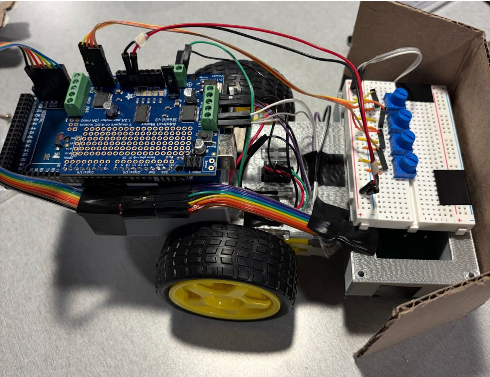

# EE201 Line Following Robot



A line-following robot built using Arduino, a custom sensor array, and PID control. This project was developed for EE 201 and focuses on integrating hardware design, embedded systems, and real-time control.

## Overview

This robot detects and follows a black line on a white surface using a photoresistor sensor array. Sensor readings are processed by an Arduino Mega, which adjusts motor speeds using a PID control algorithm to maintain alignment with the track.

## Features

- Arduino Mega + Adafruit Motor Shield
- 7-photoresistor sensor array with LED illumination
- Custom PCB design
- 3D-printed chassis
- Real-time PID control for line tracking
- Adjustable parameters using potentiometers

## Repository Structure

```text
/firmware/
  /arduino/
    /line_follower_pid/
      line_follower_pid.ino

/hardware/
  /pcb/
    sensor_array.kicad_pcb
    pcb-layout.pdf
    schematic.pdf
  /cad/
    chassis_main.stl
    arduino_breadboard_mount.stl
    prototype_part.stl

/docs/
  final-report.pdf

.gitignore
README.md
```
## Hardware Components

- Arduino Mega
- Adafruit Motor Shield
- DC motors and wheels
- Photoresistors
- LEDs
- Potentiometers
- Custom PCB
- 3D-printed chassis
- Battery power supply

## How It Works

1. Sensors detect light intensity differences between black and white surfaces.
2. The Arduino reads analog values from the sensor array.
3. A PID controller calculates the error relative to the line position.
4. Motor speeds are adjusted dynamically to correct the robot's direction.

## Results

The robot was able to follow the track with stable performance, especially at lower speeds. Environmental light and sensor distance significantly affected accuracy, which was mitigated using LEDs and a light shield.

## Future Improvements

- Improve chassis balance and structural rigidity
- Optimize PCB size and sensor placement
- Enhance performance on sharp turns
- Improve power stability

## Team Members

- Alexa Nassar
- Amelia Cai
- David Wang
